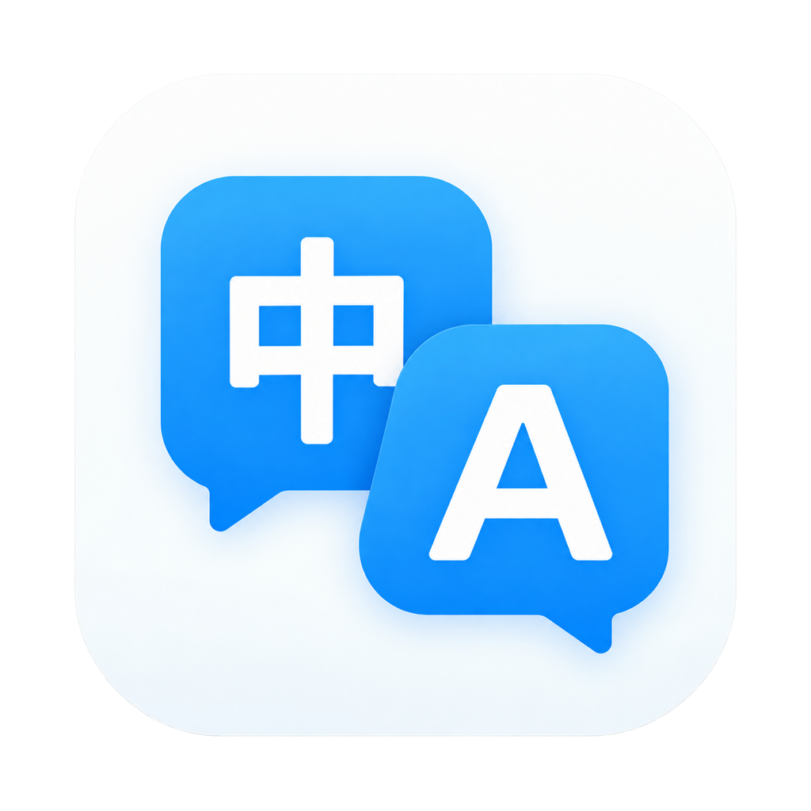

<p align="center">
  
</p>
<h1 align="center">HushTranslate</h1>
<p align="center">An LLM translation app for macOS that appears only when you need it.</p>
<p align="center"><a href="README.md">中文</a> · English</p>

## About

HushTranslate is for people who mostly read on their own and occasionally need help translating selected text or text in screenshots.

Selecting text does not always mean asking for a translation. An always-on selection translator can interrupt reading with frequent popups. HushTranslate uses **translation sessions** to control when text selection triggers translation. Start a continuous session, a session for the next N selections, or a session lasting N minutes. Then select text to translate it automatically, without pressing a shortcut each time. Limited sessions end automatically when the count or time runs out. With no active session, ordinary text selection does not trigger translation.

For example, enable translation for the next 3 selections, work through a few difficult passages, and return to uninterrupted reading. Continuous sessions can be closed from the menu bar at any time.

## Features

- **Translation sessions**: continuous, next N selections, or next N minutes, with configurable counts and durations.
- **Screenshot translation**: select a screen region and translate text recognized with local OCR by default, or use a multimodal model that accepts images.
- **Cloud and local models**: connect to model services compatible with the OpenAI Chat Completions API.
- **Lightweight results**: read translations in a floating panel with less app switching.
- **Menu bar and shortcuts**: check session status, start or close sessions, and customize keyboard shortcuts.
- **Clipboard translation**: translate text you have already copied.

## Installation and first launch

HushTranslate is distributed free of charge for Apple Silicon Macs running macOS 14 or later. Release builds use ad-hoc signing, without Apple Developer ID signing or Apple Notarization.

1. Download `HushTranslate-x.x.x.zip` from [GitHub Releases](https://github.com/muieer/hush-translate/releases).
2. Extract the ZIP file.
3. Move `HushTranslate.app` to `/Applications` (recommended, but optional).
4. Double-click the app. macOS Gatekeeper may block the first launch. If this happens, open System Settings → Privacy & Security, find the HushTranslate message, click Open Anyway, and follow the confirmation prompts.
5. After launch, follow the system prompts to grant Accessibility, Screen Recording, and any other permissions needed for the features you use. The app runs in the menu bar.
6. Configure your model service's API Key in the app settings. Obtain the key from your provider; API usage is billed to your own provider account. For local models, follow the local service's configuration requirements.

See “First use” below and the [user guide](USER_GUIDE.md) (Chinese) for configuration details.

## Build from source and use

### Requirements

- An Apple Silicon Mac running macOS 14 or later.
- A full Xcode installation with first-launch component setup completed.
- Access to GitHub to fetch dependencies on the first build.

### Build

Run from the project root:

```bash
./scripts/make-app.sh release
open build/HushTranslate.app --args --show-settings
```

The script creates `build/HushTranslate.app`. The second command launches the app and opens its settings. The app runs in the menu bar.

For development, use `./scripts/make-app.sh debug`, which requires a valid Apple Development signing certificate. See [LOCAL_RUN.md](LOCAL_RUN.md) (Chinese) for further development notes.

### First use

1. In Settings → General (「设置 → 通用」), enter your service's `Base URL`, `API Key`, and `Model`, then choose a target language. Use the API base address, such as `http://localhost:1234/v1`, without `/chat/completions`. For local models, start the model server first.
2. In Settings → Shortcuts (「设置 → 快捷键」), grant the permissions you need: Accessibility for selected-text translation and Screen Recording for screenshot translation.
3. Choose “Enable 3 selections” (「开启 3 次」) from the menu bar, then select text in another app to translate it. To change the default mode, count, or duration, open Settings → Translation Session (「设置 → 翻译会话」), then use the shortcut to start a session.

Screenshot translation can be started directly from the menu bar without an active translation session.
