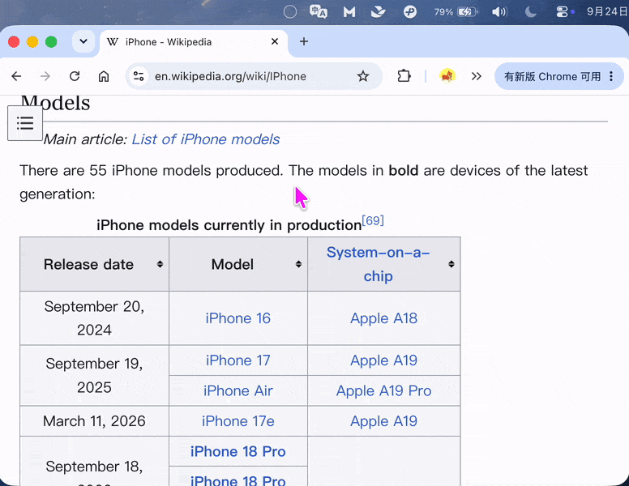

<p align="center">
  
</p>
<h1 align="center">HushTranslate</h1>
<p align="center">一款只在需要时出现的 macOS 翻译工具。</p>
<p align="center">中文 · <a href="README.en.md">English</a></p>

## 项目简述

HushTranslate 面向以自主阅读为主、偶尔需要翻译的用户，提供划词翻译和截图翻译。

选中文字不一定是为了翻译。一直开启的划词翻译容易频繁出现，打断阅读。HushTranslate 通过「翻译会话」控制何时响应划词：需要时，主动开启持续、按次数或按分钟的会话，随后划词会在选区上方显示「翻译」按钮，点击后才执行翻译，无须每次按快捷键。只有点击「翻译」才扣减会话次数。次数用完或时间到期后，会话自动关闭；关闭时，普通划词不会触发翻译。

例如，开启接下来 3 次划词翻译，处理完眼前的几处疑问后，继续安静阅读。持续会话则可以随时从菜单栏关闭。



版本变化见 [CHANGELOG.md](CHANGELOG.md)。

## 功能特征

- **划词翻译会话**：支持持续开启、开启 N 次、开启 N 分钟，次数与时长可配置。
- **截图翻译**：框选屏幕区域，默认使用本地 OCR 识别文字后翻译；也可使用支持图片输入的多模态模型。
- **可选翻译来源**：默认使用无需接口配置的 Apple 翻译，也可新增和切换多组云端或本地 OpenAI 兼容服务。
- **轻量结果面板**：在浮动窗口中查看译文，并直接切换翻译来源或语言，重新翻译同一输入，无须重新划词或消耗会话次数。
- **菜单栏与快捷键**：查看会话状态、开启或关闭会话，并自定义快捷键。
- **中英文界面**：在「设置 → 通用 → 界面语言」切换简体中文或 English，默认显示简体中文；界面语言独立于翻译的源语言和目标语言。
- **剪贴板翻译**：直接翻译已复制的文字。

## 安装与首次运行

HushTranslate 免费分发，适用于 Apple Silicon Mac。2.0.0 起要求 macOS 15 或更高版本，macOS 14 不再受支持。发布版使用 ad-hoc 签名，未使用 Apple Developer ID 签名，也未经过 Apple 公证（Notarization）。

1. 从 [GitHub Releases](https://github.com/muieer/hush-translate/releases) 下载 `HushTranslate-x.x.x.zip`。
2. 解压 ZIP 文件。
3. 建议将 `HushTranslate.app` 移至 `/Applications`（应用程序）文件夹，也可放在其他位置。
4. 双击应用。首次运行时，macOS Gatekeeper 可能阻止打开；此时前往「系统设置 → 隐私与安全性」，找到 HushTranslate 的提示，点击「仍要打开」，并按系统提示确认。
5. 启动后，根据系统提示和所需功能授予「辅助功能」「屏幕录制」等权限。应用常驻菜单栏。
6. 默认使用 Apple 翻译，无需填写接口或密钥。macOS 26.4 及以上显式选择低延时策略，较早版本使用系统默认策略；需要语言资源时，按系统提示下载。若需要 LLM，可在「设置 → 通用」添加 OpenAI 兼容服务；API Key 由用户自行获取，API 费用由自己的服务商账号承担。

具体配置见下方「首次使用」和 [使用说明](USER_GUIDE.md)（[English](USER_GUIDE.en.md)）。

## 从源码构建与使用

### 环境要求

- Apple Silicon Mac，macOS 15 或更高版本。
- 完整安装的 Xcode，并已完成首次启动时的组件安装。
- 首次构建时能够连接 GitHub，以获取依赖。

### 构建

在项目根目录执行：

```bash
./scripts/make-app.sh release
open build/HushTranslate.app --args --show-settings
```

脚本会生成 `build/HushTranslate.app`，第二条命令启动应用并打开设置。应用常驻菜单栏。

日常开发可使用 `./scripts/make-app.sh debug`，需要有效的 Apple Development 签名证书。更多开发说明见 [LOCAL_RUN.md](LOCAL_RUN.md)（[English](LOCAL_RUN.en.md)）。

### 首次使用

1. 在「设置 → 通用」选择界面语言、翻译来源和目标语言。界面默认是简体中文；切换至 English 会更新应用界面，但不改变翻译语言。默认的「Apple 翻译」无需接口配置。使用 LLM 时，点击「添加服务」，填写服务名称、接口地址（Base URL）、API Key 和模型名称，再点击「保存」。接口地址例如 `http://localhost:1234/v1`，不要包含 `/chat/completions`；使用本地模型前，先启动对应服务。
2. 在「设置 → 快捷键」中按需授权：划词翻译需要「辅助功能」权限，截图翻译需要「屏幕录制」权限。
3. 从菜单栏选择「开启 3 次」，然后在其他应用中选中文字，点击选区上方的「翻译」按钮开始翻译。也可在「设置 → 翻译会话」中修改默认模式、次数和时长，再用快捷键启动会话。

截图翻译可直接从菜单栏启动，无须开启划词翻译会话。

可保存多组 LLM 服务，并在设置或结果窗口的「翻译来源」中切换。修改服务后需点击「保存」；在设置窗口内切换来源会保留草稿，关闭设置后丢弃未保存的修改。Apple 翻译不能删除。升级后默认选择 Apple，旧接口保留为「原有服务」，可随时切回。划词、剪贴板和截图统一使用当前来源；Apple 截图使用本地 Vision OCR。选择 LLM 时，截图仍会发送到所选服务，包括本地 Vision 模式。
